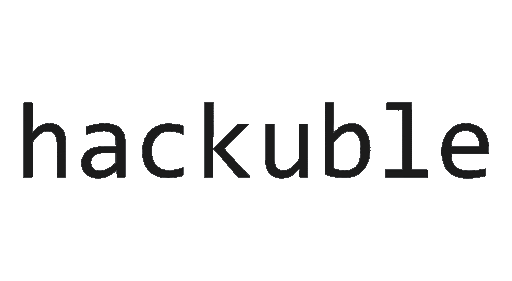
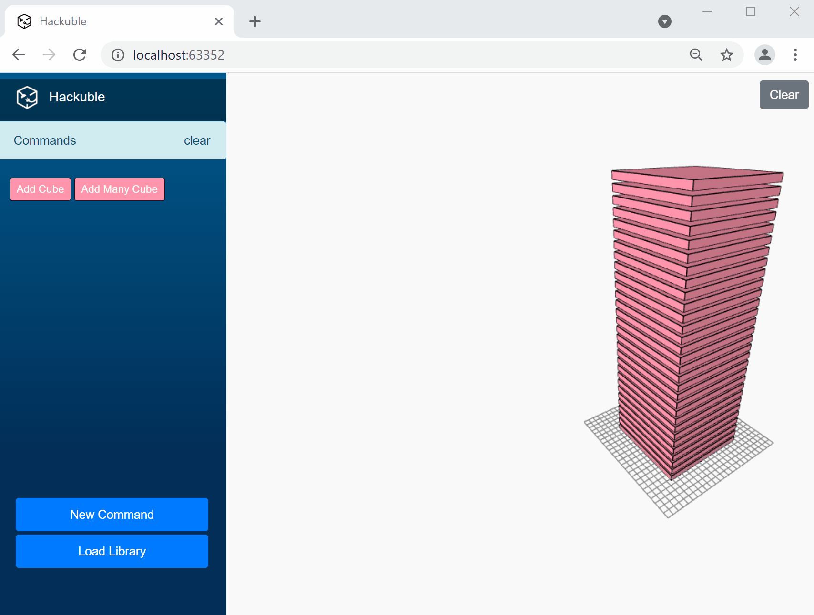

# HACKUBLE

   
*A hackable C# based script environment for 3D modeling running in the web browser.* 

## Background
Script based 3D modeling software running in the web browser typically requires expertise in JavaScript. This isn't a suprising fact, since web browsers are built specifically for interpreting and executing JavaScript code. However, while JavaScript is a great language, many professionals in the AEC industry (architecture, engineering and construction), are far more comfortable with programming languages such as C#. This is mainly because lots of CAD, BIM and analysis software have C# SDKs which has wide adoption. That means that they either have to pick up the entire new language and eco system, or go back to desktop based 3D software to be productive. Hackuble aims to bridge this gap.

Hackuble is a generative 3D modeling environment built to write and execute C# code in the browser. Scripts can either be authored in the application, or brought in by loading dll libraries. The scripts can manipulate the 3D scene, such as adding objects. When compiled or imported, they become a button, which can be executed.

## Context
This project was developed in the context of AEC Summer Hackathon 2021. The team consisted of the following people:
- Emil Poulsen [TT CORE Studio // Stockholm]
- Praneet Mathur [ARPM Design and Research // India]
- Hanshen Sun [TT CORE Studio // New York]
- Yankun Yang [iBuilt Group // New York]
- Yushi Kato [Turner & Townsend // Japan]

Among other things, a major motivation for this project was the democratization of tools for design. The power to develop your own tools implies freedom and empowerment of creativity.

## Features

### Write, compile and execute C# scripts in the browser.
Hackuble comes with an in-browser scripting editor, where you can write and compile C# code to interact with the 3D viewport. Add your code to the `RunCommand` method and hit compile. You'll see a new button showing up which can be pressed to execute your code.


*Writing, compiling and running scripts in Hackuble.*

### Register command arguments to provide user input
Commands can have input arguments, which will be presented as a modal to the user when running the script. Override the `RegisterInput` and register your input params with their type, name, description and default value. Then use the `DataAccess` object inside of the `RunCommand` method to read the input values of the parameters.  


*Adding a command with custom inputs.*

### Use the Hackuble SDK to build your own script libraries (dll) in Visual Studio
Hackuble offers an alternative way to add commands to the user interface. By importing the `Hackuble.Core` dll into your own dotnet standard library, you can write and compile your own Hackuble plugin and upload it to the web application at runtime. The dll is then parsed and all types inheriting from `AbstractCommand` will be registered and added to the user interface.  


*Compiling and uploading custom Hackuble plugin dlls from Visual Studio.*

## Create a script
Hackuble's system for adding scripts should look familiar to someone with experience with Revit/Rhino/Grasshopper development:

- Create a script by adding a new class and inherit from `AbstractCommand`.
- Write your script in the `Run` override method.
- A `Context` object is injected into the `Run` method, which you can use to interact with the scene, for instance adding objects to the scene. 
- Each script can have a series of input parameters. These will be presented to a user through a modal in which they can specify values for the input parameters. Use the `RegisterArgument` override to add inputs.

See example below:
```csharp
public class AddCubeWithColorCommand : AbstractCommand
{
    //Override there properties to configure the command.
    public override string Name => "Add Cube With Color";
    public override string Author => "Emil Poulsen";
    public override string Description => "Add a cuboid to the scene";
    public override string CommandLineName => "cube-colors";
    public override string Accent => "#FF96AD";

    //Here's where inputs are registered
    public override void RegisterInputArguments(DataAccess dataAccess)
    {
        dataAccess.RegisterTextArgument("Color", "The color of the cube in Hex Format", "#FF96AD");
    }

    //Here's the method that is called when the button is clicked.
    public override CommandStatus RunCommand(Context context, DataAccess dataAccess)
    {
        //Use the DataAccess object to read the user provided inputs registered above.
        string c = "#ffffff";
        if (!dataAccess.GetData<string>(0, ref c))
        {
            return CommandStatus.Failure;
        }

        //Use the context object to add a cube with specified color to the view port.
        context.AddCube(20.0, 20.0, 20.0, 0, 0, 0, c);
        return CommandStatus.Success;
    }
}
```

## Tech stack
The following key technoligies have been adopted in Hackuble: 
- Blazor WebAssembly
- Three.js
- CodeMirror

Note that Hackuble is a front-end only application, meaning there is no need for a back-end. This is possible through Blazor and WebAssembly.

## Getting started
### Prerequisites
* Latest version of VisualStudio 2019 [link](https://visualstudio.microsoft.com/downloads/)

### Installation
1. clone the repo

```sh
git clone https://github.com/EmilPoulsen/AecHackBlazor.git
```

2. open `Hackuble.sln`
3. Compile the `Hackuble.Examples` project.
4. Set the `Hackbule.Web` project to start up and hit the debug button.
5. Once the application is started, click on the "Load Library" button on the side bar. Locate the `Hackuble.Examples.dll` in the output from step 3 and select it.
6. You should see buttons showing up in the sidebar.
7. Clicking on one of those

## Create Command
you can choose the 2 options.
1. Upload `.dll` file from your local as described above.
2. Create your own custom command from your browser. hit `New Command`

## License

